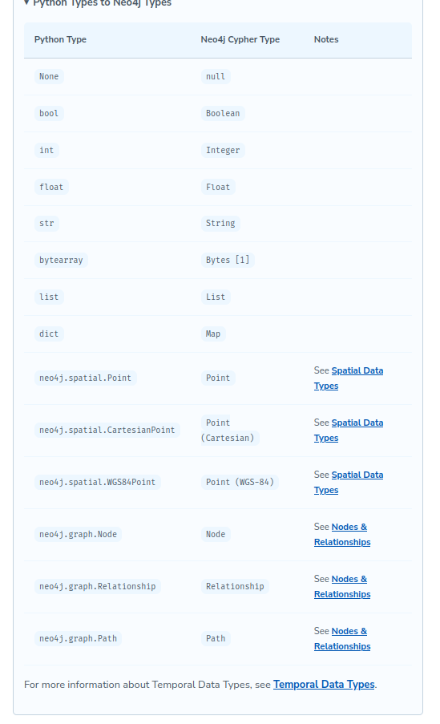
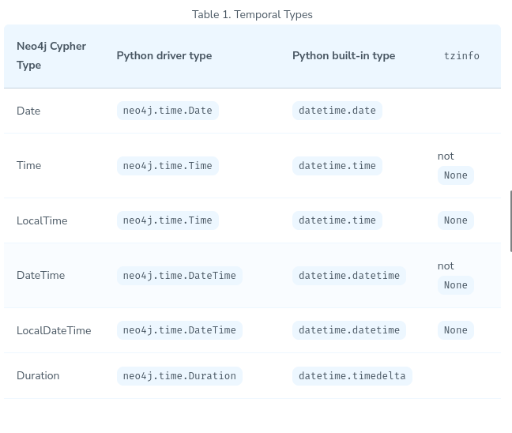

# Neo4j

```
pytest tests/01_connect_to_neo4j__test.py -v --log-cli-level=DEBUG
```

> A session is a container for a sequence of transactions. Sessions borrow connections from a pool as required and are considered lightweight and disposable.

> A transaction comprises a unit of work performed against a database. It is treated in a coherent and reliable way, independent of other transactions.

ACID Transactions = atomic, consistent, isolated, and durable

1. Auto-commit Transactions
   1. The driver will not repeat query in term of erros
2. Read Transactions
   1. You do not need to explicitly commit a read transaction.
3. Write Transactions

   1. In clustered environments, write queries are sent exclusively to the leader of the cluster.
   2.

# test

1. peek
2. keys
3. single
4. value
5. values
6. python dictionary

# Node

Node is a type provided by the Neo4j Python Driver to hold the information held in Neo4j for the node.

```
print(node.id)              # (1)
print(node.labels)          # (2)
print(node.items())         # (3)

# (4)
print(node["name"])
print(node.get("name", "N/A"))
```

> Internal IDs refer to the position in the Neo4j store files where the record is held. These numbers can be re-used, a best practice is to always look up a node by an indexed property rather than relying on an internal ID.

# Path

The relationships within a path can be iterated over using the iter() function.

```
for rel in iter(path):
    print(rel.type)
    print(rel.start_node)
    print(rel.end_node)
```

# Types



# Date



```
# Create a DateTime instance using individual values
datetime = neo4j.time.DateTime(year, month, day, hour, minute, second, nanosecond)

#  Create a DateTime  a time stamp (seconds since unix epoch).
from_timestamp = neo4j.time.DateTime(1609459200000) # 2021-01-01

# Get the current date and time.
now = neo4j.time.DateTime.now()

print(now.year) # 2022
```

# Unique Constraits should be created manually

```
CREATE CONSTRAINT UserEmailUnique
IF NOT EXISTS
FOR (user:User)
REQUIRE user.email IS UNIQUE;
```

# Query

1. Merge
   1. > By using the MERGE keyword here, we will overwrite an existing rating if one already exists. This way we don’t need to worry about duplicates or deleting existing records.
   2. > MERGE either matches existing nodes and binds them, or it creates new data and binds that. It’s like a combination of MATCH and CREATE that additionally allows you to specify what happens if the data was matched or created.
   3. https://neo4j.com/docs/cypher-manual/current/clauses/merge/#query-merge-introduction
2. Match

# Notices

Escaped Braces

You may have noticed that the code block above features double curly braces ({{ and }}) within the MATCH clause rather than the single braces used within the Cypher statement.

MATCH (u:User {{userId: $userId}})

Braces need to be escaped within a Python string, and we do this by using double quotes.

# test

1. There are three schemas `neo4j`, `neo4j+s`, `neo4j+ssc`(and bolt).
2. https://graphacademy.neo4j.com/courses/app-python
3. https://neo4j.com/docs/api/python-driver/current/api.html
